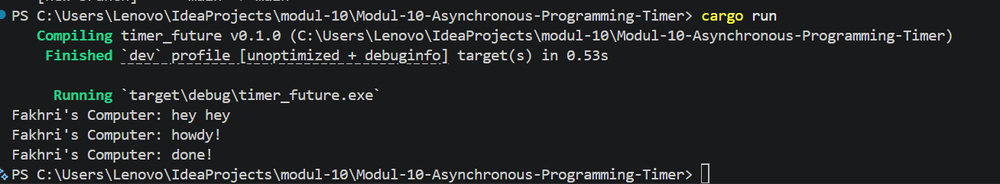
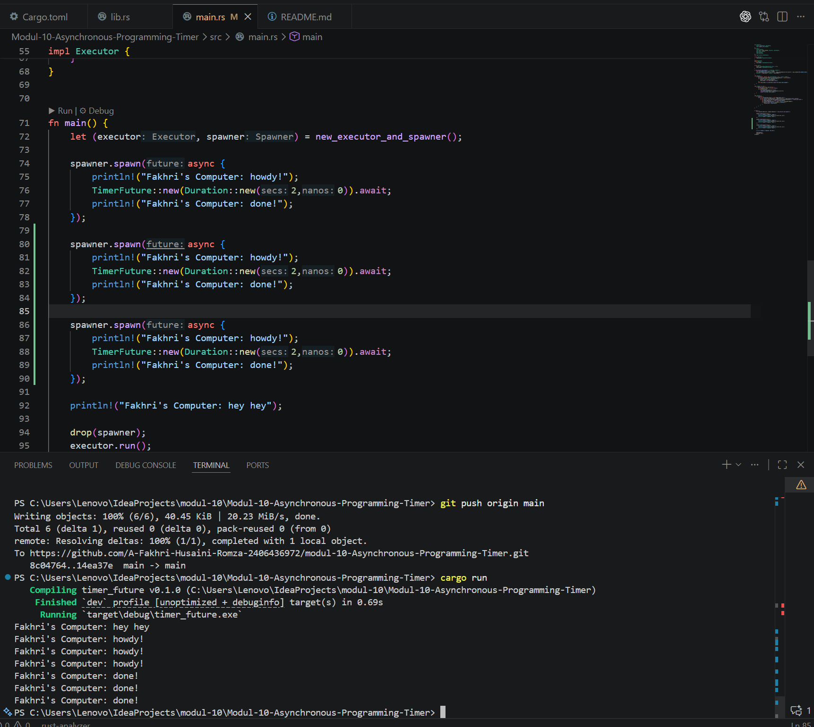
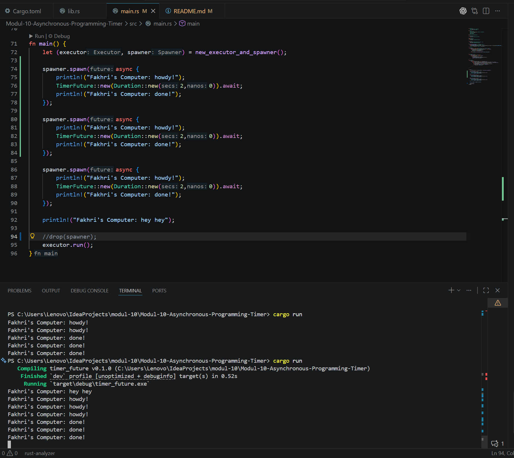

## Penjelasan Hasil Eksekusi

Alasan mengapa urutan output yang dicetak adalah:
1. `Fakhri's Computer: hey hey`
2. `Fakhri's Computer: howdy!`
3. `Fakhri's Computer: done!`

Hal ini terjadi karena alur eksekusi dari *asynchronous programming* pada Rust:

1. **`hey hey` tercetak pertama:** Pada fungsi `main`, perintah `spawner.spawn` hanya bertugas untuk membuat dan mendaftarkan sebuah *future task* (dari blok `async`) ke dalam *channel* antrian (queue). Kode di dalam blok `async` tersebut **belum dijalankan**. Eksekusi baris kode terus berlanjut ke bawah dan langsung mengeksekusi `println!("Fakhri's Computer: hey hey");` secara sinkronus di-thread utama. Itulah sebabnya `hey hey` muncul paling awal.
2. **`howdy!` tercetak kedua:** Setelah itu, program memanggil `executor.run()`. Executor akan mengambil *task* yang mengantri dan mulai menjalankannya dengan cara memanggil fungsi `poll()` pada state *future* tersebut. Saat di-poll untuk pertama kalinya, kode di dalam blok `async` baru mulai dieksekusi, sehingga mencetak pesan `Fakhri's Computer: howdy!`.
3. **`done!` tercetak terakhir:** Di baris selanjutnya, terdapat `TimerFuture::new(Duration::new(2,0)).await;`. Ekspresi `.await` membuat *task* tersebut tertahan (yield) karena mengembalikan `Poll::Pending` dari eksekusi `TimerFuture`, sambil menunggu selesainya perhitungan *timer* (2 detik) di thread lain. Setelah 2 detik, thread pengatur waktu memberikan sinyal (*waker*) agar executor memeriksa *task* ini kembali. Executor melanjutkan eksekusi dari *task* tersebut setelah jeda waktu selesai, sehingga bagian akhir dari blok `async` dijalankan dan mencetak `Fakhri's Computer: done!`.

## Penjelasan Perbedaan `drop(spawner)` (Gambar 1 vs Gambar 2)

Pada kedua gambar tersebut, kode dimodifikasi untuk menjalankan 3 *task* (3 kali pemanggilan `spawner.spawn`), sehingga output `howdy!` dan `done!` dicetak masing-masing sebanyak tiga kali. Namun, terdapat perbedaan krusial pada kode program yang memengaruhi eksekusinya:

1. **Gambar Pertama (dengan drop):**
    Terlihat bahwa baris `drop(spawner);` diaktifkan dan dipanggil sebelum `executor.run()`. Perintah ini menghancurkan instance `spawner`, yang menutup *channel sender*. Begitu *executor* selesai memproses 3 task yang ada, fungsi `recv()` akan mendeteksi bahwa *sender* telah terputus (dropped). Hal tersebut mengakhiri _looping_ eksekusi, sehingga **program dapat berhenti/selesai dengan sukses** (terminate) dan terminal kembali menampilkan prompt.

2. **Gambar Kedua (tanpa drop):**
   Terlihat bahwa baris `// drop(spawner);` dibuat menjadi *comment* (dikomentari). Ketika `spawner` tidak di-*drop*, memori tetap menyimpan referensi terhadap *channel sender* (`SyncSender`). Akibatnya, metode `self.ready_queue.recv()` di dalam `executor.run()` akan terus me-blok jalannya thread, menunggu pesan/task dari *sender* yang tidak akan pernah datang lagi. **Program menjadi *hang* (tertahan)** dan tidak bisa selesai atau kembali ke prompt terminal secara otomatis meskipun seluruh task sudah selesai.